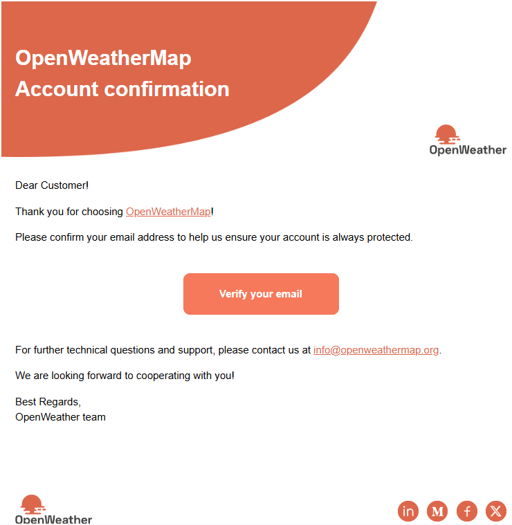
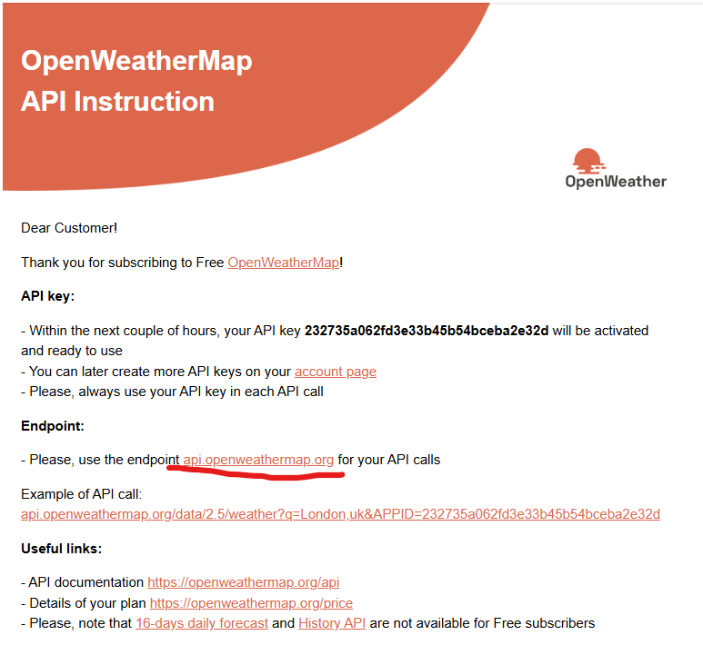
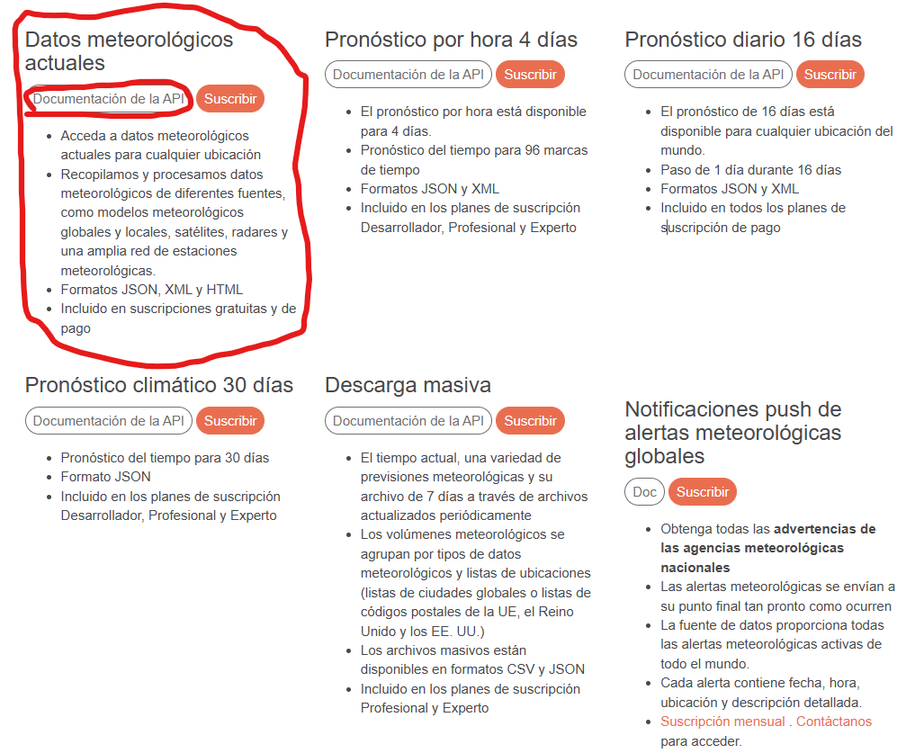
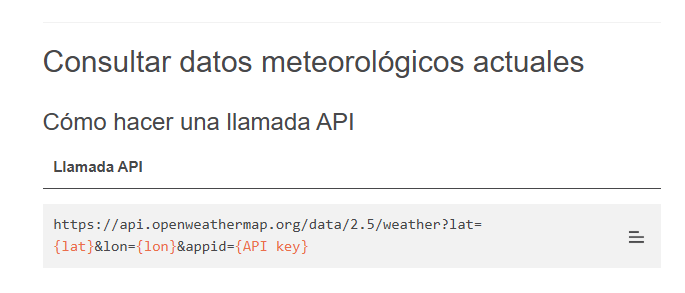
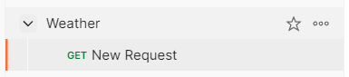
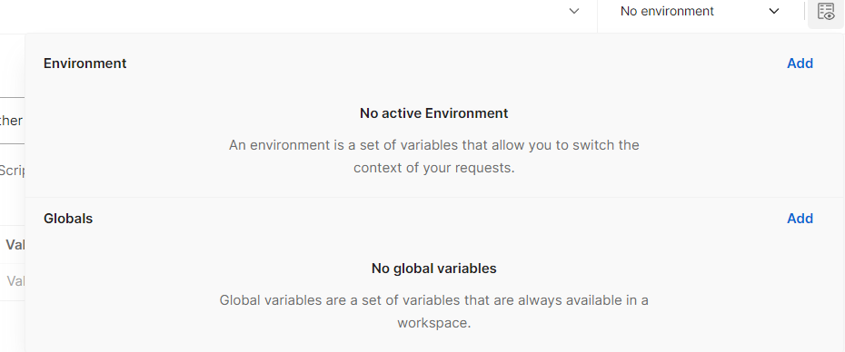
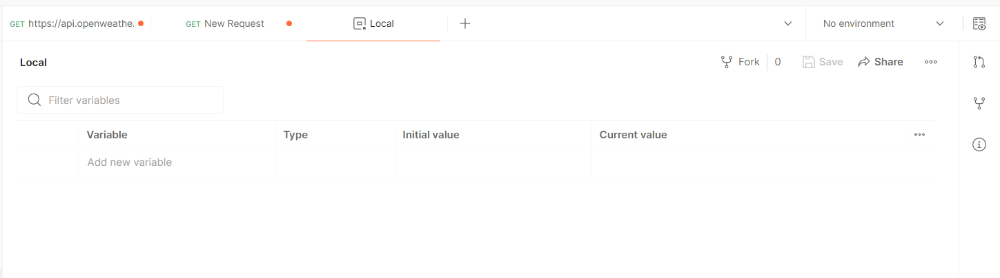
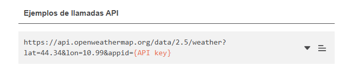
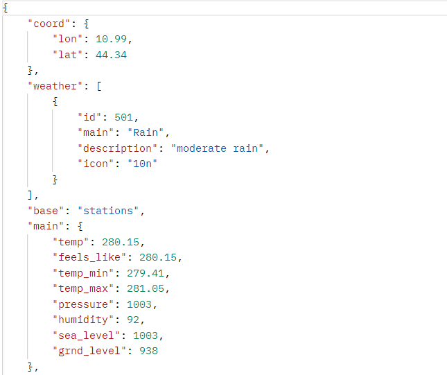
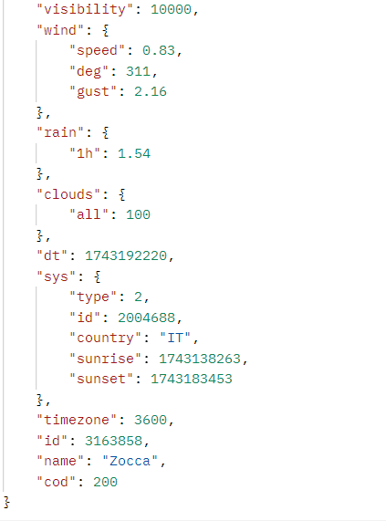

# Documentación de consumo de API OpenWeatherMap

Este es un paso a paso de cómo vamos a consumir la API 

## Prerrequisitos necesarios para el consumo de la API
- Cuenta en [OpenWeatherMap](https://openweathermap.org)
- API Key (nos la dan al momento del registro)
- Herramienta para el consumo:
    -[Postman] (https://www.postman.com/) 

## Paso a Paso

### Paso 1 (Creación de la cuenta)
- Acceder al siguiente enlace: (https://openweathermap.org)
- En la parte superior izquierda de la página damos click en la pestaña **Sign In**, así como lo muestra la siguiente imagen: 
- Si no tienes una cuenta, debes crearla, dando click aquí: 
- Una vez creada la cuenta nos llegará un correo de confirmación: 

### Paso 2
- Una vez tenemos nuestra cuenta nos llegan al correo de cómo consumir la API
Ingresamos al siguiente enlace: (https://openweathermap.org/api) 
- Seleccionamos la API que deseamos consumir, en mi caso seleccioné **Datos meteorológicos actuales** y damos click en **Documentación de la API** 

### Paso 3 (Obtención de la API)
- En la página nos brinda la URL de la API que vamos a consumir:  
[API](https://api.openweathermap.org/data/2.5/weather?lat={lat}&lon={lon}&appid={API key})

> **_nota_ debemos esperar unos minutos para poder hacer consumo de la API**

### Paso 4 (Consumo de la API en Postman)
- Abrimos Postman
- Creamos una nueva collección  en mi caso la llamé **Weather**
- Luego en la parte superior izquierda creamos un nuevo ambiente  damos click en **Add**
- Nombramos el ambiente  yo lo llamé **Local** y añadimos la API key en campo **Initial value** y dejamo seleccionado este ambiente
- Ahora, tomamos el ejemplo que nos dan en la página de el llamado de la API  https://api.openweathermap.org/data/2.5/weather?lat=44.34&lon=10.99&appid={API key} en donde se cambiaron la latitud y longitud de la localidad de los datos deseados
- Lo pegamos en el **GET** de **New request**  y camibamos el parámetro **{API key}** por la clave que añadimos en el ambiente **Local**, quedaría de al siguiente manera: 
- Damos click en **Send** para obtener el llamado de la API 
- Obtenemos la siguiente respuesta en formato **JSON**: 

> **_Así estaría culminado el proceso de consumo de la API de [OpenWeatherMap]_**

## Significado de los resultados del JSON

### Coordenadas Geográficas
| Campo       | Tipo  | Descripción |
|-------------|-------|-------------|
| `coord.lon` | float | Longitud de la ubicación |
| `coord.lat` | float | Latitud de la ubicación |

### Condiciones Meteorológicas (weather)
_Array con múltiples condiciones_

| Campo            | Tipo   | Descripción |
|------------------|--------|-------------|
| `weather.id`     | int    | ID de condiciones meteorológicas ([Códigos](https://openweathermap.org/weather-conditions)) |
| `weather.main`   | string | Grupo principal (lluvia, nieve, nubes, etc.) |
| `weather.description` | string | Descripción detallada (disponible en [múltiples idiomas](https://openweathermap.org/current#multi)) |
| `weather.icon`   | string | ID del icono (ej: `"04d"` para nubes de día) |

### Datos Principales (main)
| Campo               | Tipo  | Descripción |
|---------------------|-------|-------------|
| `main.temp`         | float | Temperatura actual (Kelvin por defecto, Celsius/Fahrenheit con parámetros) |
| `main.feels_like`   | float | Sensación térmica (percepción humana) |
| `main.pressure`    | int   | Presión atmosférica (hPa) |
| `main.humidity`    | int   | Humedad relativa (%) |
| `main.temp_min`    | float | Temperatura mínima observada (en zonas urbanas) |
| `main.temp_max`    | float | Temperatura máxima observada (en zonas urbanas) |
| `main.sea_level`   | int   | Presión a nivel del mar (hPa) |
| `main.grnd_level` | int   | Presión a nivel del suelo (hPa) |

### Viento (wind)
| Campo          | Tipo  | Descripción |
|----------------|-------|-------------|
| `wind.speed`  | float | Velocidad (m/s por defecto) |
| `wind.deg`    | int   | Dirección en grados (0°=Norte, 90°=Este) |
| `wind.gust`   | float | Ráfagas máximas (m/s) |

### Nubes
| Campo         | Tipo | Descripción |
|---------------|------|-------------|
| `clouds.all` | int  | Porcentaje de nubosidad (0-100%) |

### Precipitación
| Campo       | Tipo  | Descripción |
|-------------|-------|-------------|
| `rain.1h`  | float | Lluvia en los últimos 60 minutos (mm) |
| `snow.1h`  | float | Nieve en los últimos 60 minutos (mm) |

### Metadatos
| Campo          | Tipo   | Descripción |
|----------------|--------|-------------|
| `dt`          | int    | Fecha/hora de cálculo (Unix UTC) |
| `timezone`    | int    | Desplazamiento UTC en segundos |
| `id`         | int    | ID único de ciudad (obsoleto) |
| `name`       | string | Nombre de la ciudad |

### Sistema (sys)
| Campo           | Tipo   | Descripción |
|-----------------|--------|-------------|
| `sys.country`  | string | Código de país (ej: "ES") |
| `sys.sunrise`  | int    | Amanecer (Unix UTC) |
| `sys.sunset`   | int    | Atardecer (Unix UTC) |

> **Notas**: 
> - Los campos `base`, `sys.type`, `sys.id`, `sys.message` y `cod` son para uso interno.
> - Unidades personalizables con parámetros `units=metric` (Celsius) o `units=imperial` (Fahrenheit).
> - [Documentación oficial](https://openweathermap.org/current#current_JSON)

